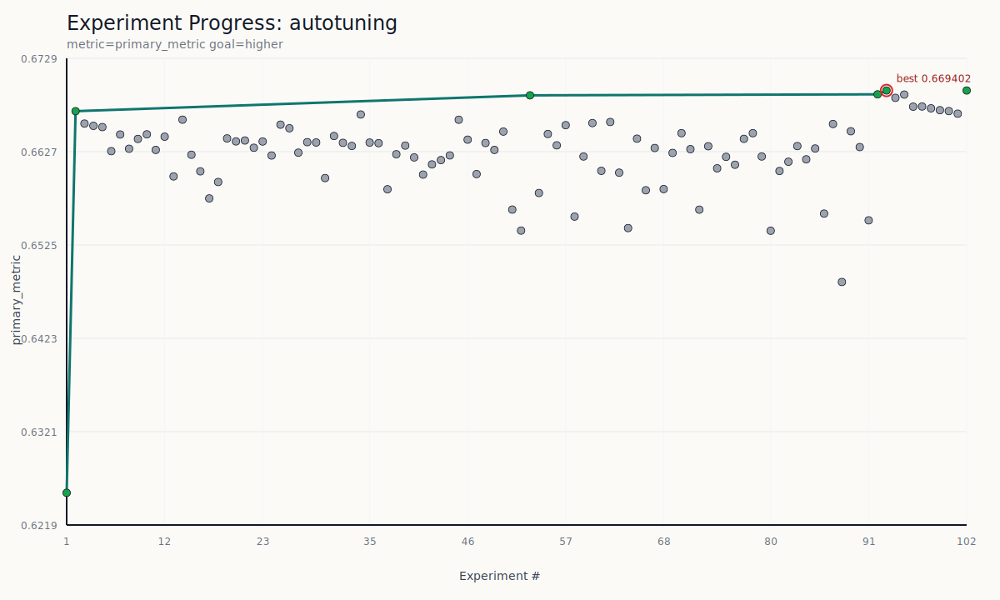

# Agent Smith

  

This repository is intended to become a hub for agent skills related to machine learning, experimentation, and automated tuning workflows.

For now, it includes:

- the base `agent-smith` skill in [`.agents/skills/agent-smith/`](.agents/skills/agent-smith/SKILL.md)
- the `r-docker` skill in [`.agents/skills/r-docker/`](.agents/skills/r-docker/SKILL.md)
- a small working demo project for tabular binary classification on the Kaggle insurance claims dataset

The longer-term goal is to grow this repository into a collection of reusable skills for different ML and experimentation tasks, while keeping concrete example projects here for testing and demos.

This work is inspired by [`autoresearch`](https://github.com/karpathy/autoresearch), adapted here toward more general experiment-loop scaffolding.

## Current Skill

`agent-smith` is the first bundled skill. It is designed to:

  

- scaffold or detect a `prepare.py`, `train.py`, and `program.md` workflow
- standardize Python package management around `uv`
- support experiment logging, branch-based iteration, and post-run summarization
- generalize across different problem types as long as the workflow produces a metric

## R-Docker Skill

`r-docker` runs R models and visualizations via Docker (`rocker/r-ver:latest`) without a local R installation. See [`.agents/skills/r-docker/SKILL.md`](.agents/skills/r-docker/SKILL.md).

- fits any R model (earth/MARS, glm, gam, randomForest, svm, xgboost) inside a disposable Docker container
- accepts CSV input; auto-converts `.npy`, `.parquet`, `.tsv`, `.json`, `.xlsx`
- two execution modes:
  - **one-off** (`scripts/run_r.sh`): `docker run --rm` with a package cache volume
  - **experiment loop** (`scripts/r_worker.sh`): persistent container with packages installed once, fast `docker exec` per run
- integrates with `agent-smith`: the `.R` script becomes the mutable experiment surface, tuned via the same edit → run → commit/revert cycle
- includes templates for earth, glm, ggplot2, and a generic skeleton

## Current Demo Project

The current root-level demo is a tabular binary-classification setup:

- `prepare.py` handles stable data download and preprocessing
- `train.py` handles the mutable model and training baseline
- `program.md` defines the experiment rules for autonomous tuning

Current baseline:

- task: binary classification
- target: `claim_status`
- primary metric: validation AUC
- default workflow: keep the held-out validation split fixed across experiments

## Quick Start

1. Install dependencies with `uv sync`
2. Prepare the dataset with `uv run prepare.py`
3. Run the baseline with `uv run train.py`

## Example Agent-Smith Run

This repository was used in a real Agent Smith experiment loop with the prompt:

> "Use Agent Smith skill and run up to 100 experiments to improve the current model."

The run went like this:

1. Agent Smith inspected the repo, resolved `prepare.py`, `train.py`, and `program.md`, and inferred the metric contract as validation AUC with `higher` as better.
2. It kept the validation split fixed, created a dedicated experiment branch, verified `uv`, and ran the baseline model first.
3. The baseline logistic regression scored `0.625464` validation AUC.
4. A fast model-family scan showed HistGradientBoosting was materially stronger than the logistic baseline, so the search space shifted toward boosted trees instead of spending the 100-run budget on weaker families.
5. The agent then ran a reproducible 100-experiment batch: 90 single-model HistGradientBoosting candidates followed by 10 weighted blends of the best single runs.
6. The best blend was `hgb_rand_052@0.7 + hgb_rand_033@0.3`, which reached `0.669402` validation AUC.
7. `train.py` was updated to make that winning blend the default model, and the final verification run reproduced the same `0.669402` score.

That run improved validation AUC by `+0.043938` absolute over baseline while preserving the core Agent Smith contract:

- `prepare.py` stayed fixed
- `train.py` remained the mutable experiment surface
- all experiments used the same held-out split
- each run was judged by the same machine-readable summary block

The progress plot at the top of this README comes from that run, and `search_experiments.py` now captures the same experiment loop as a reproducible script.

## Notes

- Treat this repository as both a skill library and a sandbox for validating those skills.
- Keep local data, logs, caches, and transient experiment outputs out of git.
- Treat `program.md` as the operating guide for future experiment runs in the current demo project.
